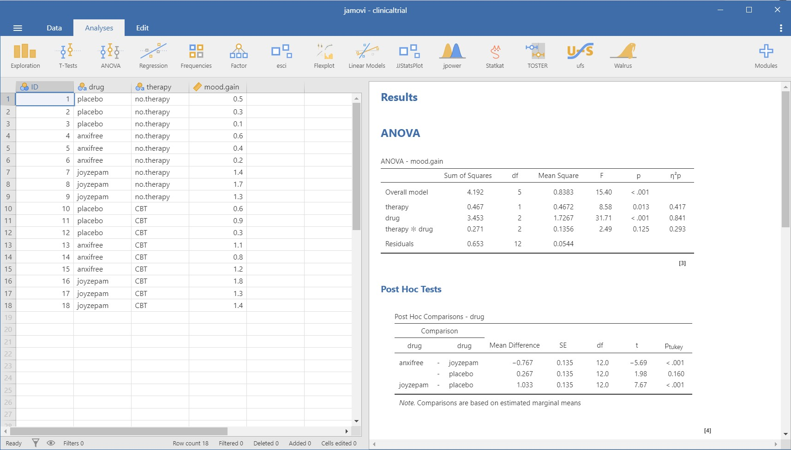

# Why you should *not* learn R {.unnumbered}

Before we look at ten good reasons to learn R, we have to get something out of the way:
there are very good reasons *not* to learn R! I do not want to discourage you from
learning R --- personally, I think R is one of the greatest tool a researcher or data
analyst can have --- but I also understand that it's not for everyone and it is important
to consider the cost of learning R and the possible alternatives.

```{r, echo=FALSE, fig.cap="Regardless of what R enthusiasts like me will tell you, R is not the solution to every problem.", fig.alt="A picture of the Evergreen container ship stuck sideways in the Suez Canal"}
knitr::include_graphics("images/have-you-tried-using-R.jpeg")
```

## Learning R is a considerable time investment {.unnumbered}

First of all, R can be challenging to learn. Learning any programming language
requires continuous practice, and depending on your previous experience and your ability
to think like a computer, it will take months or years before you can work efficiently in
R.[^why-not-1] Getting there can---at times---be frustrating. This investment of time and cognitive
energy may never pay off if you only do a small analysis every once in a while or if your
current workflow is already very efficient.

[^why-not-1]: Even if you already know another programming language, R may be difficult to
    learn, because it can be a little weird. For examples of R's weirdness, I recommend
    John Cook's talk [*The R Language The Good The Bad & The
    Ugly*](https://youtu.be/6S9r_YbqHy8) and Roger Peng's talk [*Teaching R to New Users:
    From tapply to Tidyverse*](https://youtu.be/5033jBHFiHE)*.*

## Free point and click alternatives {.unnumbered}

There are free alternatives to R that do not require coding. Some of them excel at a
particular part of the data analysis workflow, for example,

-   [OpenRefine](https://openrefine.org/) and
    [DataWrangler](http://vis.stanford.edu/wrangler/) for data wrangling, and

-   [RAWgraphs](https://rawgraphs.io/), [Flourish](https://flourish.studio/),
    [DataWrapper](https://www.datawrapper.de/), and [Tableau
    Public](https://public.tableau.com/) for data visualization.

Others offer comprehensive functionality which rivals that of costly software like SPSS.
[Jamovi](https://www.jamovi.org/) and [JASP](https://jasp-stats.org/), for example, are
graphical user interfaces that are built on top of R and allow you to utilize much of R's
power without writing any code.

```{r, echo=FALSE, fig.cap="There are plenty of fish in the open source sea and Jamovi is a particularly tasty one.", fig.alt="A screenshot of Jamovi's user interface"}

```

## Commercial software {.unnumbered}

There are many well-rounded commercial software packages for data analysis, such as SPSS,
SAS, Stata, MPlus, and MATLAB. Chances are, you are already familiar with at least one of
them. Some commercial tools are the gold standard for certain types of analyses and the
exact same methods may not be available in R.[^why-not-2]

[^why-not-2]: For example, handling missing data with Maximum Likelihood in MPlus is not
    possible in the equivalent R package, `{MClust}`.

Commercial software often does a better job than R at guiding you through the jungle of
statistical tests and models, they provide customer support and there is normally a
single, well-documented way to solve a certain type of problem. In contrast, R often
offers a multitude of ways to reach the same goal. While this allows you to choose the
tools that suit your needs, this choice can be difficult. Consequently, R requires a more
thorough understanding of what your are trying to achieve.

```{r, echo=FALSE, fig.cap="Welcome to R! Here's how you quit...", fig.alt="A gif of the R console cursor blinking expectantly"}
knitr::include_graphics("images/blinking-console.gif")
```

## Other programming languages {.unnumbered}

Point-and-click graphical user interface such as SPSS or Jamovi only work well if you stay
within the limits that the developers of these tools had in mind. Programming gives you
much more versatility and flexibility,[^why-not-3] and it is certainly a useful skill to
have under your belt, even if you end up not using it much. However, R is by no means the
only programming language you could choose to learn. For example,

[^why-not-3]: In computer science this is referred to as the [*expressive
    power*](https://en.wikipedia.org/wiki/Expressive_power_(computer_science)) of a
    programming language

-   [Python](https://www.python.org/) is worth a look if you want to learn a language that
    is more universally useful than R while still being excellent for data analysis,
-   [Julia](https://julialang.org/) is a great choice If you need a language that is as
    focused on interactive scientific computing as R, but more modern and a lot faster
-   [Javascript](https://developer.mozilla.org/en-US/docs/Web/JavaScript), the language of
    the web, is great if you are interested in building interactive data visualizations,
    but it is also shaping up to become a serious contender in the data analysis
    space.[^why-not-4]

[^why-not-4]: For example, see <https://js4ds.org/>
