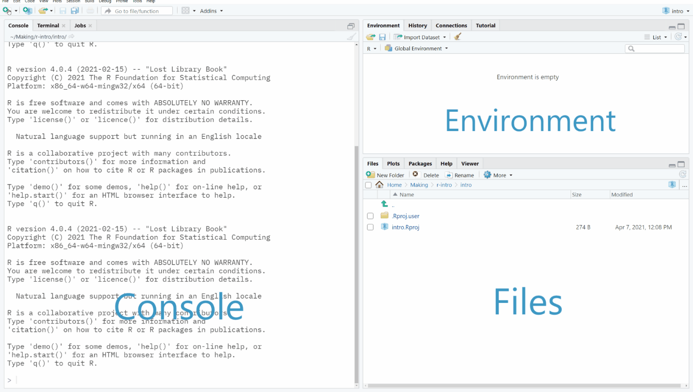

# It's easy to get started

Getting R to run on your computer is usually a relatively smooth experience.

::: {.exercise}
Download and install the latest version of [R](https://www.r-project.org/) and [RStudio](https://www.rstudio.com/products/rstudio/) for your operating system. If you already have either program installed on your computer, there is no need to uninstall them beforehand.
If you'd rather not install anything on your machine, you can make an account at [rstudio.cloud](https://rstudio.cloud/) and use R and RStudio in the browser.
:::

That's it! Everything else you need can be set up from within RStudio.[^easy-start-1]

[^easy-start-1]: For some things, e.g., Bayesian statistic, you might also need to install [RTools](https://cran.r-project.org/bin/windows/Rtools/). RTools provides additional tools that don't come with the standard R installation, such as a C/C++ compiler. For reproducible research, you should also install [Git](https://git-scm.com/). RStudio has a Git GUI built in, but personally I prefer [Github Desktop](https://desktop.github.com/). We will briefly talk about Git later, but it really deserves its own workshop. For maximum reproducibility you could install Docker, so that you can create an RStudio [Docker container](https://www.rocker-project.org/) for each project, but that is beyond the scope of this intro. For now, you do not have to worry about these things, because you can always do them later.

You might be wondering what RStudio is and why we need it. RStudio is a popular *all-in-one* user interface (Integrated Development Environment, *IDE*) for R. It provides many conveniences that make working with R a lot easier. To use an analogy: If R were a horse, RStudio would be a saddle to sit in. You don't need it, but it makes things more comfortable. There are some alternatives to RStudio, but R's own GUI is not really one of them:

```{r, echo=FALSE, fig.cap="R's own GUI --- The 90s called...they want their user interface back.", fig.alt="A screenshot of RGui"}
knitr::include_graphics("images/r-gui.jpeg")
```

## Create a new RStudio project

Alright cowboy, let's saddle that horse! The first step you should do whenever you start a new data analysis project with RStudio is to create a new project folder. This is the first step towards reproducibility: All of your project's data and files will be stored in this folder. If you ever move this folder to a new location or share it with someone else, all of the files will move along with it and nothing will break.

::: {.exercise}
Open RStudio, go to `File ▸ New Project...` and create a new RStudio project in an empty folder. Leave *Use version control* and *Use renv* unchecked for now --- we will get back to those later.
:::

Now that we have our project set up, let's have a look around RStudio. 

```{r, echo=FALSE, fig.cap="RStudio's user interface", fig.alt="A screen capture of the RStudio user interface"}

```

The many panels and tabs in RStudio may be overwhelming at first, but I promise this gets better over time, and most of them are actually really helpful. The console, for example, allows you to directly interact with R. You can type commands in there and when you press <kbd>Enter</kbd>, R will try to interpret them.

### Operators

Let's get familiar with R's operators by trying them in the console.
R has all the operators that you would expect to find in a pocket calculator:

|                                      |                   |
|--------------------------------------|-------------------|
| Arithmetic                           | `+ - * / ^`       |
| Modular arithmetic                   | `%% %/%`          |
| Relational                           | `< > <= >= == !=` |
| Logical                              | `&& || ! | &`     |
| Parentheses for modifying precedence | `(1 + 2) * 10`    |

::: {.exercise}
In the *console*, try out some of R's operators and see what happens. For example, what does `1 != 1.0` do? Use <kbd>Enter</kbd> to run commands, use <kbd>↑</kbd> and <kbd>↓</kbd> to recall previous commands.
:::

```{r, echo=FALSE, fig.cap="Don't worry -- you can't hurt R, it has been through this before...", fig.alt="Hello Operator Meme"}

```

### Create a script

The console is useful for running quick throw-away commands, and sometimes that's all you need. However, code that you want to keep should be stored in a script file. R scripts still allow a flexible console-like workflow: You can run individual sections or lines in a script in any order by using <kbd>Ctrl</kbd> + <kbd>Enter</kbd> or the buttons on the top right of the script panel.

::: {.exercise}
Create a script file and save it in your project's working directory. Note how the file has appeared in RStudio's `Files` tab, which shows you all the files in your project folder.
Now type and run a few commands. What happens if you run `list.files()`? 
:::
